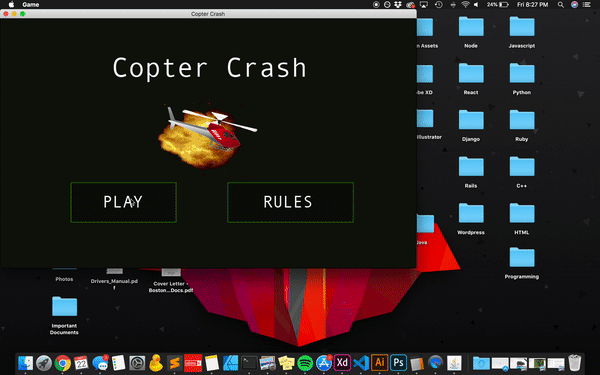

# Copter Crash

A twist on the classic Helicopter Game built using Java Swing in fulfilment
of a project for Tufts COMP 86 - Graphical User Interfaces. In this take of the Helicopter Game, the helicopter has to dodge lazers in addition to the obstacle it typically faces. Every few minutes, the difficulty level increases, as you are ambushed with lazers faster and faster.

# Objective

The prime purpose was to create a simulation based GUI software to explore
OOP. This project proved to be an exploration into making intuitive and usable 
user interfaces, as well as a walk down memory lane that allowed me to 
re-create one of the iconic games of my childhood.

# How To Run
To compile, go to the project root directory and type:
`javac -d bin src/*.java`

To run the game, go to the directory bin and type:
`cd bin`
`java Game`

Click the mouse to make the helicopter fly, or do nothing to let it fall!

# Project Features

* Random terrain generation
* Collision detection
* State maintenance of all objects in the simulation
* Score Tracking (see if you can beat the highest score!)
* Retro/Vintage animations (made with love using Adobe Illustrator)

# Notes

1. There is scope for future design improvement by creating a simulation class 
that creates a better separation between the drawing of the GUI and the state
maintenance for the simulation
2. There is also need for use of more static private variables to create a
single point of truth for presets like the velocity of the different objects 
in the simulation

# Credits

1. Thanks to artist for the amazing helicopter.gif 
   (source - https://ya-webdesign.com/imgdownload.html)

